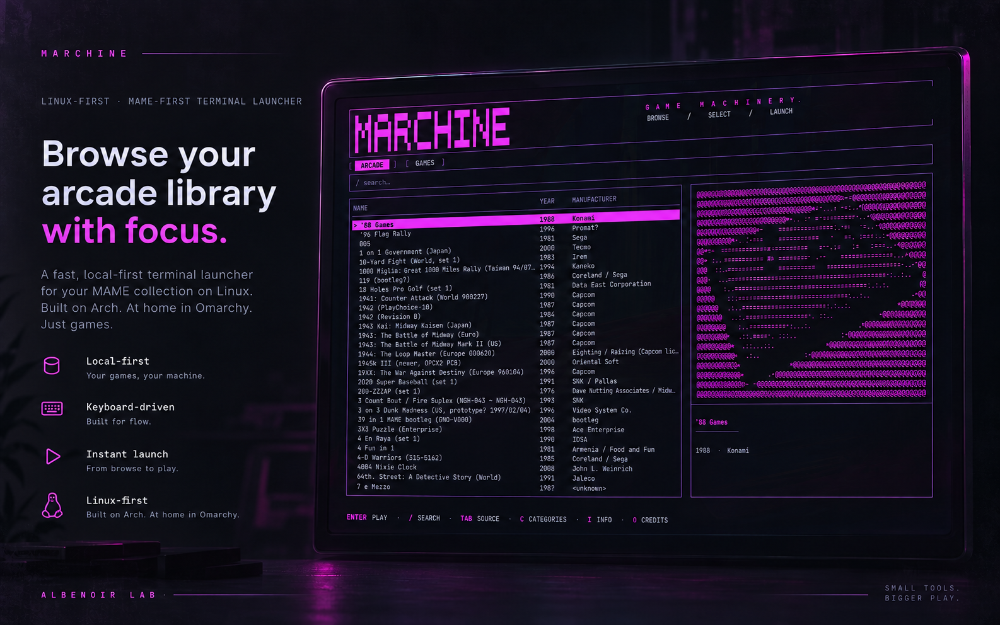
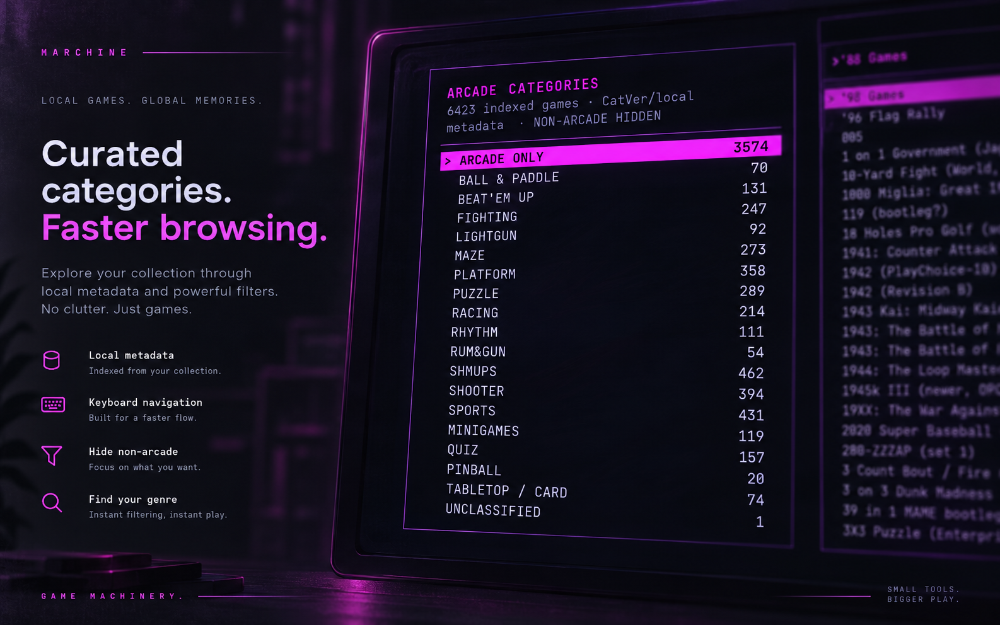
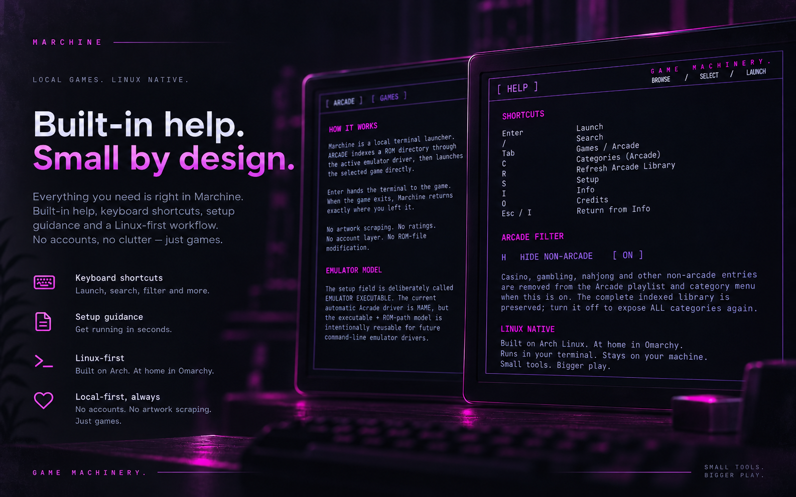

# Marchine

**Game Machinery.**

**Linux-first, terminal-native game launcher. Built on Arch. At home in Omarchy. MAME-first by design.**

[Get Marchine](https://github.com/Magik23/Marchine/releases/latest) · [Albenoir Lab](https://albenoir.com/lab/)



Marchine is a focused, keyboard-driven launcher for games you already own and can run locally.

It is intentionally **not** a game encyclopedia. There is no artwork scraping, account layer, ratings wall, achievements feed, store metadata, or cloud library. Marchine indexes what you can launch, keeps useful local metadata close, and gets out of the way.

## Get Marchine

### Prebuilt Linux release

The current GitHub release workflow publishes a **Linux amd64** archive and SHA-256 checksum.

1. Open the [latest release](https://github.com/Magik23/Marchine/releases/latest).
2. Download:
   - `marchine-vX.Y.Z-linux-amd64.tar.gz`
   - `marchine-vX.Y.Z-linux-amd64.tar.gz.sha256`
3. Verify and install:

```bash
sha256sum -c marchine-vX.Y.Z-linux-amd64.tar.gz.sha256
tar -xzf marchine-vX.Y.Z-linux-amd64.tar.gz

install -Dm755 marchine "$HOME/.local/bin/marchine"

marchine --init-config
marchine
```

If `~/.local/bin` is not already on your `PATH`, add it through your shell configuration.

### Requirements

- Linux
- A Unicode-capable terminal; truecolor is recommended
- MAME for the automatic **ARCADE** source
- No MAME requirement for manually configured **GAMES** entries

Marchine is developed on Arch Linux and fits naturally into keyboard-driven desktops such as Omarchy and Hyprland. It is not tied to Omarchy itself.

## What Marchine does

Marchine has two intentionally simple sources.

### GAMES

A flat list of things you can execute.

Display identity stays separate from launch identity:

```toml
[[games]]
name = "OpenTyrian"
command = "opentyrian"
args = []
```

You can also launch scripts, native executables, Steam commands, or other local targets.

### ARCADE

The current automatic Arcade driver is **MAME**.

Marchine discovers installed ROMs, asks MAME for canonical machine identity and metadata, optionally applies local CatVer category data, and builds a persistent local Arcade library.

Typical visible metadata is deliberately restrained:

```text
NAME                     YEAR   MANUFACTURER
DoDonPachi               1997   Cave
Battle Garegga           1996   Raizing
R-Type                   1987   Irem
```

Marchine does not rename, move, repair, or delete ROMs.

## Fast startup, explicit refresh

Marchine keeps the indexed Arcade library locally so normal startup does not need to rescan thousands of ROM files or ask MAME for metadata every time.

```text
Normal launch
    ↓
Load saved Arcade library
    ↓
Browse / search / filter
```

When your ROM collection changes, press:

```text
R
```

to **Refresh Arcade Library**.

The refresh pipeline uses the configured ROM source, MAME metadata, and optional CatVer data to rebuild the saved library.

A temporarily unavailable ROM drive or missing MAME executable should not silently erase a previously valid library.

The normal cache lives at:

```text
~/.cache/marchine/arcade.json
```

For diagnostics:

```bash
marchine --doctor
marchine --doctor --rescan
```

## Categories without the encyclopedia



Marchine treats categories as views over one indexed library rather than separate duplicated playlists.

CatVer is optional local metadata. When available, Marchine can expose launcher-oriented groups such as:

```text
SHMUPS
FIGHTING
RUN & GUN
BEAT 'EM UP
RACING
PUZZLE
```

`HIDE NON-ARCADE` is non-destructive. It changes what the interface presents; it does not delete entries from the underlying index or touch ROM files.

## Built-in help, small by design



Marchine keeps setup, shortcuts, project information, and credits inside the TUI.

### Main controls

| Key | Action |
| --- | --- |
| `↑` / `↓`, `j` / `k` | Navigate |
| `/` | Search |
| `Tab` | Switch Games / Arcade |
| `C` | Arcade categories |
| `Enter` | Launch |
| `R` | Refresh Arcade Library |
| `H` | Toggle Hide Non-Arcade |
| `T` | Cycle theme |
| `S` | Setup |
| `I` | Info |
| `O` | Credits |
| `Q` | Quit |

Marchine also supports `PgUp`, `PgDown`, `Home`, and `End` for longer lists.

## Setup

Open Setup with:

```text
S
```

The two primary Arcade fields are deliberately neutral:

```text
EMULATOR EXECUTABLE
ROM PATH
```

The current automatic driver is MAME, but the executable + ROM-path relationship is intentionally reusable for future command-line emulator drivers.

Configuration is stored at:

```text
~/.config/marchine/config.toml
```

You can create a starter configuration explicitly with:

```bash
marchine --init-config
```

An empty ROM path allows Marchine to use MAME's configured `rompath` and common Linux MAME locations.

### Optional CatVer metadata

Marchine does not scrape online game databases.

If a local CatVer file is available, it can be configured explicitly or discovered from common Linux locations such as:

```text
~/.mame/catver.ini
~/.attract/metadata/catver.ini
~/MAME-Curation/catver.ini
/usr/share/mame/catver.ini
```

## Built with

- **Go**
- **Bubble Tea**
- **Lip Gloss**
- **MAME** for the current automatic Arcade driver
- **TOML** for local configuration
- optional **CatVer** for local category metadata

The interface is a native terminal UI. There is no Electron shell, browser renderer, artwork service, or online account layer.

## Build from source

Requirements:

- Linux
- Go 1.23.2+
- Git
- `make`

```bash
git clone https://github.com/Magik23/Marchine.git
cd Marchine

make test
make build

./dist/marchine --version
./dist/marchine --demo
```

Install the locally built binary:

```bash
make install
marchine --init-config
marchine
```

Marchine vendors its Go dependencies, so normal build and test targets can use the committed dependency snapshot.

## Project structure

```text
cmd/marchine/        program entry point and CLI flags
internal/config/     TOML configuration and path handling
internal/library/    normalized launchable game model
internal/mame/       MAME indexing, local metadata and Arcade cache
internal/ui/         Bubble Tea model, views, themes and terminal sculpture
docs/                architecture and project notes
packaging/           distribution packaging work
scripts/             local install helpers
```

## Design boundary

Marchine deliberately separates responsibilities:

```text
MAME
  machine identity
  machine metadata
  ROM dependency rules
  emulation

CatVer
  optional local category metadata

Marchine
  local indexing
  saved records
  search and filters
  category views
  launch orchestration
  terminal interface
```

The guiding idea is simple:

> **MAME defines what the games are. CatVer helps describe what kind of games they are. Marchine remembers the result. The user decides when to refresh it.**

## Small by design

Marchine deliberately does not try to become a game database.

- no artwork scraping
- no account layer
- no ratings or reviews
- no achievement system
- no ROM-file modification
- no provider/store wall
- no encyclopedia sprawl

It indexes what you own and launches it cleanly.

## Status

Marchine is an active Linux-first project. The current automatic Arcade driver is MAME; additional command-line emulator drivers are possible when they fit Marchine's simple model:

```text
EMULATOR + ROM PATH → INDEX → EXECUTE
```

## Credits

**Marchine — Game Machinery.**

Conceived, directed, and designed by **Pierre Dionne / Albenoir Studio**.

Built in Go with Bubble Tea and Lip Gloss.

## License

Marchine is released under the [MIT License](LICENSE).
